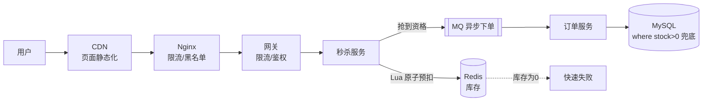
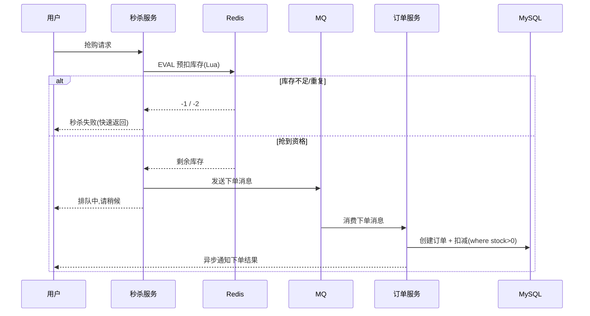
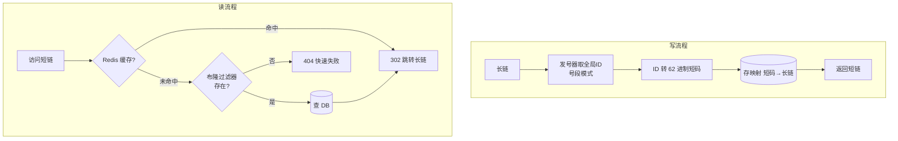
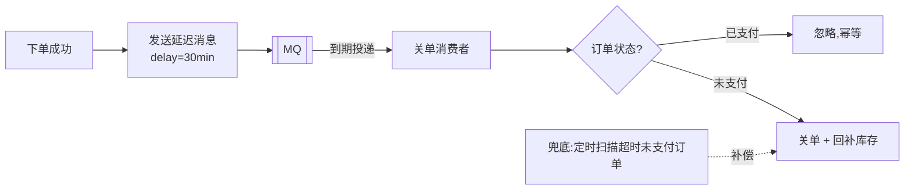
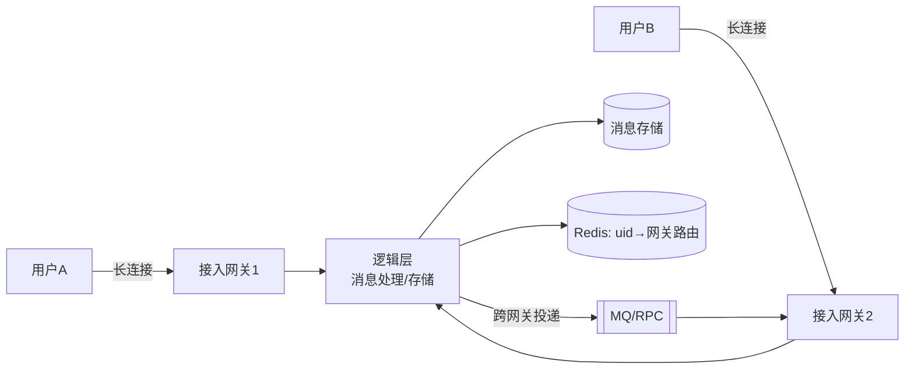
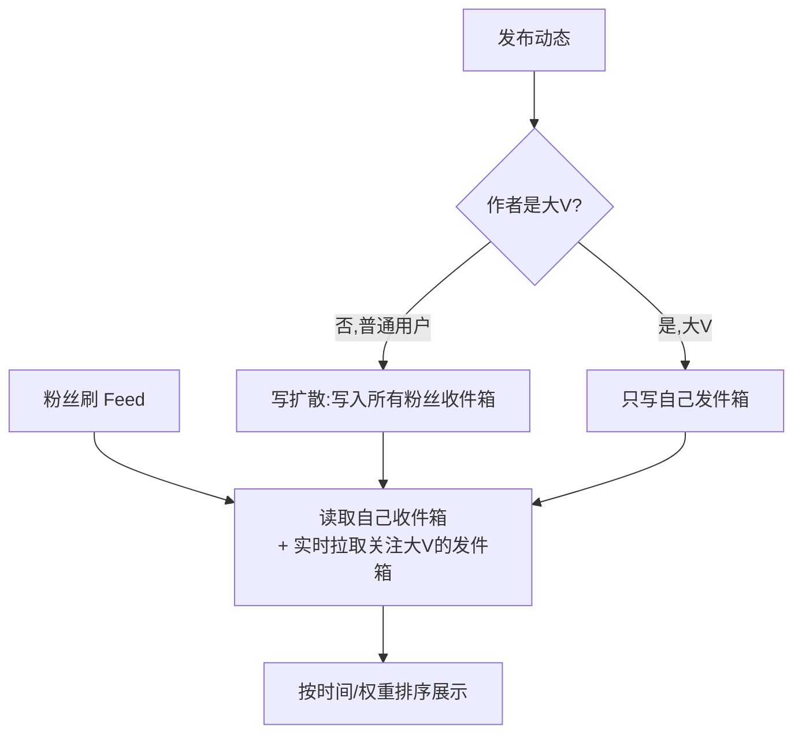

# 23 · 系统设计 / 场景题

> 资深 / 架构师面试的**主战场**。这里给出高频场景题的设计思路与权衡。系统设计没有标准答案，关键是体现：**需求澄清 → 容量估算 → 整体架构 → 核心难点 → 取舍说明**的方法论。

---

## 通用方法论（先背下来）🔥

任何系统设计题，按这个框架展开就不会乱：

1. **需求澄清**：功能性需求（要做什么）+ 非功能性需求（QPS、数据量、延迟、一致性要求、读写比）。
2. **容量估算**：QPS（日活 × 人均请求 / 86400，峰值 ×2~5）、存储（条数 × 单条大小 × 时间）、带宽。
3. **顶层设计**：接入层（LB/网关）→ 应用层（无状态、可水平扩展）→ 缓存层 → 存储层 → 异步层（MQ）。
4. **核心链路细化**：把最难的点（高并发写、一致性、热点）单独深挖。
5. **取舍说明**：CAP 怎么选、一致性 vs 性能、成本 vs 可用性。

---

## 一、秒杀系统 🔥🔥（最高频）

### 核心矛盾

**瞬时超高并发 + 有限库存 + 不能超卖**。读多写少，热点极度集中。

### 设计要点（分层削流）

核心思想：**层层过滤，让真正到达 DB 的请求降到最低**。



1. **前端**：按钮置灰、答题/验证码错峰、静态资源 CDN，拦掉一部分流量。
2. **接入层限流**：Nginx + 网关做 IP/用户限流，只放少量真实请求进来。
3. **库存预热到 Redis**：用 Redis 扣减库存（Lua 保证「判断 + 扣减」原子 + 防超卖），库存为 0 直接快速失败。
4. **异步下单**：抢到资格的请求写入 MQ，下游订单服务慢慢消费落库，**削峰填谷**。
5. **防超卖**：Redis 预扣 + Lua 原子判断；DB 层加 `where stock > 0` 兜底（乐观锁）。
6. **防重复/防刷**：一人一单（用户 ID + 商品 ID 唯一索引）、限流、风控、令牌/验证码。

### 库存预扣 Lua 脚本（原子）

```lua
-- KEYS[1]=库存key  KEYS[2]=已购用户set  ARGV[1]=userId
-- 返回: -1 库存不足, -2 重复购买, >=0 扣减后剩余库存
if redis.call('SISMEMBER', KEYS[2], ARGV[1]) == 1 then
    return -2                                  -- 一人一单
end
local stock = tonumber(redis.call('GET', KEYS[1]))
if not stock or stock <= 0 then
    return -1                                  -- 库存不足，快速失败
end
redis.call('DECR', KEYS[1])                    -- 扣库存
redis.call('SADD', KEYS[2], ARGV[1])           -- 记录已购
return stock - 1
```

### 下单链路时序



### 关键追问

- **超卖怎么彻底防？** Redis Lua 原子扣减 + DB 乐观锁双保险，最终以 DB 为准。
- **少卖（钱扣了单没生成）？** 异步下单失败要回补库存、可靠消息 + 对账。
- **热点 key 问题？** 单个商品库存是超级热点 → 库存分桶（把 100 库存拆成 10 个 key 各 10），分散压力。

---

## 二、短链系统（TinyURL）🔥

### 需求

长 URL → 短码（如 `t.cn/abc123`），访问短链 302 跳转回长链。读多写少（读:写 ≈ 100:1）。

### 短码生成方案

| 方案 | 说明 | 取舍 |
| --- | --- | --- |
| **发号器 + 62 进制** | 全局自增 ID 转 `[0-9a-zA-Z]` 62 进制 | **推荐**，短、不重复、可控 |
| Hash（MD5 取前几位） | 对长链 hash | 有冲突，需处理 |
| 随机生成 + 查重 | 随机串查 DB 是否存在 | 冲突重试，慢 |

- 6 位 62 进制可表示 `62^6 ≈ 568 亿`，足够。
- 发号器用号段模式（DB 批量取 ID 段缓存到内存）避免每次访问 DB。

### 架构



- 写：长链 → 发号器取 ID → 62 进制编码 → 存映射 → 返回短链。
- 读：短码 → 缓存/DB 查长链 → **302 跳转**（302 临时重定向便于统计 PV；301 会被浏览器缓存导致统计不到）。
- 热点短链放 Redis，**布隆过滤器**拦截不存在的短码防穿透。

---

## 三、订单超时关闭 🔥（延迟任务经典题）

下单后 30 分钟未支付自动关单，怎么实现？

| 方案 | 优点 | 缺点 |
| --- | --- | --- |
| **定时轮询 DB** | 简单 | 扫表压力大、有延迟、不精准 |
| **JDK 延迟队列 `DelayQueue`** | 精准 | 单机、重启丢失、内存占用 |
| **Redis ZSet**（score=到期时间，轮询 `ZRANGEBYSCORE`） | 分布式、可靠 | 需自己实现轮询 |
| **Redis 过期 key 监听**（keyspace notification） | 简单 | 通知不可靠、有延迟 |
| **MQ 延迟消息**（RocketMQ / RabbitMQ TTL+死信） | **推荐**，可靠、分布式、解耦 | 依赖 MQ |
| **时间轮（Netty HashedWheelTimer）** | 高效海量定时 | 单机、需持久化兜底 |

> 生产推荐 **RocketMQ 延迟消息 / 时间轮 + DB 兜底扫描**。关单时要校验状态（幂等），防止已支付的被误关。



---

## 四、IM / 即时通讯 ⭐

### 核心问题

长连接管理、消息可靠投递、消息有序、离线消息、读扩散 vs 写扩散。



### 要点

- **长连接**：WebSocket / 自定义 TCP（Netty），客户端与接入层维持心跳。
- **连接路由**：用户 → 接入网关的映射存 Redis（`uid → gatewayId`），跨网关转发用 MQ / RPC。
- **消息可靠**：发送方 ACK + 服务端持久化 + 接收方 ACK，未 ACK 重推（注意幂等去重，用 msgId）。
- **消息有序**：单会话用递增 seq 保证顺序，乱序则客户端按 seq 重排。
- **离线消息**：存储后用户上线拉取（写扩散：群消息每人一份信箱；读扩散：群一份大家来读，省存储但读放大）。
- **群聊**：小群写扩散，大群/直播读扩散。

---

## 五、Feed 流 / 朋友圈 / 微博 ⭐

### 推拉模式

- **推模式（写扩散）**：发布时写入所有粉丝的收件箱（timeline）。读快，但大 V 发一条要写千万次（写放大），存储大。
- **拉模式（读扩散）**：发布只写自己，读时实时聚合关注的人。写快省存储，但读慢（聚合多人）。
- **推拉结合（推荐）**：普通用户用推，大 V 用拉；活跃粉丝推、不活跃拉。微博就是这套。



---

## 六、排行榜 / 热搜榜 ⭐

- **Redis ZSet**：`ZADD` 加分、`ZREVRANGE` 取 TopN，O(log n)，天然支持实时排行。
- 海量数据 TopK：分片局部 TopK + 归并，或用 Redis ZSet 分片。
- 实时热搜：滑动窗口计数（多个时间桶）+ 衰减，避免历史数据霸榜。

---

## 七、分布式限流系统设计 ⭐

- 单机限流：Guava `RateLimiter`（令牌桶）、Sentinel。
- 分布式限流：**Redis + Lua**（原子计数/令牌桶）、Sentinel 集群限流、网关层限流。
- 算法见 [24-高并发高可用](./24-高并发高可用.md)。

---

## 八、其它高频场景速记

| 场景 | 核心方案 |
| --- | --- |
| 分布式 ID | Snowflake / 号段 / Leaf（见 [15-分布式](./15-分布式.md)） |
| 附近的人 | Redis GEO（geohash） |
| 点赞/计数 | Redis incr + 异步落库 |
| 去重（海量 URL/UV） | 布隆过滤器 / HyperLogLog |
| 全局搜索 | ElasticSearch + Canal 同步（见 [21-ES](./21-ElasticSearch.md)） |
| 支付对账 | 异步对账 + 状态机 + 可靠消息 |
| 大文件上传 | 分片上传 + 断点续传 + 秒传（hash 查重） |

---

## 高频追问清单

- 秒杀怎么防超卖、怎么削峰？→ Redis Lua 预扣 + MQ 异步 + DB 兜底（一）。
- 订单超时关闭用什么实现，为什么不轮询 DB？→ MQ 延迟消息 / 时间轮（三）。
- Feed 流推还是拉？→ 推拉结合，按用户活跃度和粉丝量区分（五）。
- 系统设计怎么估容量？→ QPS/存储/带宽估算（方法论）。
