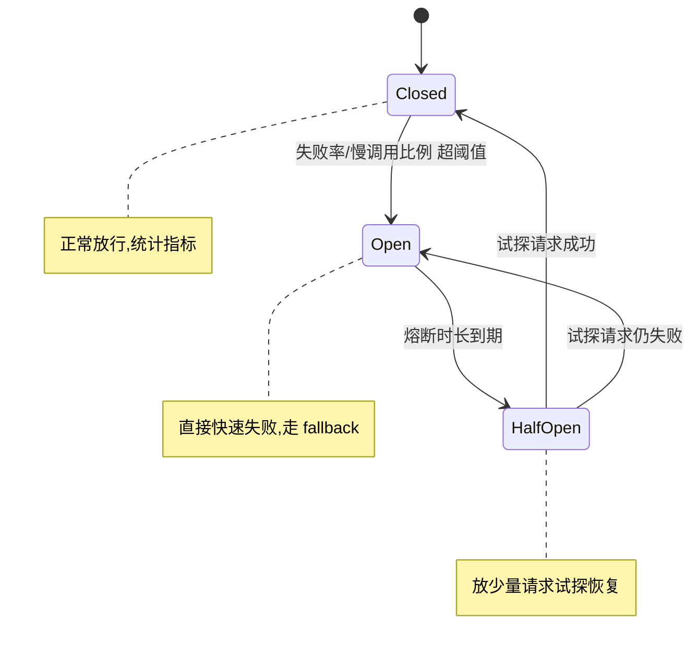
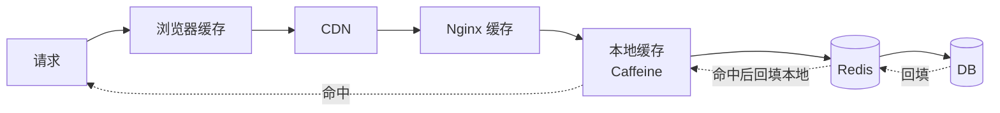

# 24 · 高并发与高可用架构

> 覆盖：高并发三板斧（缓存/异步/并行）、限流算法、熔断降级、多级缓存、读写分离、CDN、高可用设计（冗余/隔离/容灾/异地多活）、容量评估。这是架构师岗的核心能力篇。

---

## 一、高并发的整体思路 🔥

应对高并发的本质是**「减少请求到达后端的量」+「提升单点处理能力」+「水平扩展」**：

1. **缓存**：多级缓存挡住绝大多数读（浏览器 → CDN → Nginx → 本地缓存 → Redis → DB）。
2. **异步**：MQ 削峰、非核心流程异步化。
3. **并行/池化**：线程池、连接池、批量处理。
4. **水平扩展**：服务无状态化 + 负载均衡，加机器就能扩容。
5. **隔离与降级**：限流、熔断、降级，保住核心。
6. **读写分离 + 分库分表**：扩展存储层。

---

## 二、限流 🔥🔥

### 1. 四种限流算法

| 算法 | 原理 | 特点 |
| --- | --- | --- |
| **固定窗口计数** | 每个时间窗口计数，超限拒绝 | 简单，但**临界突刺**（窗口交界处可能 2 倍流量） |
| **滑动窗口** | 把窗口细分为多个小格滑动统计 | 平滑临界问题（Sentinel 默认） |
| **漏桶（Leaky Bucket）** | 请求入桶，**恒定速率**流出 | 强行平滑，**不允许突发**，多余丢弃 |
| **令牌桶（Token Bucket）** | 恒定速率发令牌，有令牌才放行 | **允许一定突发**（攒令牌），最常用 |

### 2. 限流的落地

- **单机**：Guava `RateLimiter`（令牌桶）、Sentinel、Resilience4j。
- **分布式**：Redis + Lua（原子计数/令牌桶）、Sentinel 集群流控、网关限流（Gateway + Redis）。
- **接入层**：Nginx `limit_req`（漏桶）/`limit_conn`。

**① 单机令牌桶（Guava RateLimiter）**：

```java
// 每秒发放 100 个令牌（允许预热/突发）
private final RateLimiter rateLimiter = RateLimiter.create(100);

public Result handle() {
    if (!rateLimiter.tryAcquire(200, TimeUnit.MILLISECONDS)) { // 最多等 200ms
        return Result.fail("系统繁忙，请稍后重试");                 // 限流降级
    }
    return doBusiness();
}
```

**② 注解式限流（Sentinel）**：

```java
@SentinelResource(value = "createOrder",
    blockHandler = "blockHandler",   // 被限流/降级时调用
    fallback = "fallback")           // 业务异常时调用
public Order createOrder(Long uid) { return orderService.create(uid); }

public Order blockHandler(Long uid, BlockException ex) {
    return Order.rejected("当前下单人数过多");
}
```

> 规则可在 Sentinel 控制台动态配置 QPS 阈值、流控效果（快速失败 / Warm Up 预热 / 排队等待）。

**③ 分布式令牌桶（Redis + Lua，原子）**：

```lua
-- KEYS[1]=令牌桶key  ARGV[1]=容量 ARGV[2]=速率/秒 ARGV[3]=当前时间(秒) ARGV[4]=本次取令牌数
local cap   = tonumber(ARGV[1])
local rate  = tonumber(ARGV[2])
local now   = tonumber(ARGV[3])
local need  = tonumber(ARGV[4])
local data  = redis.call('HMGET', KEYS[1], 'tokens', 'ts')
local tokens = tonumber(data[1]) or cap
local ts     = tonumber(data[2]) or now
-- 按时间差补充令牌（不超过容量）
tokens = math.min(cap, tokens + (now - ts) * rate)
local allowed = tokens >= need
if allowed then tokens = tokens - need end
redis.call('HMSET', KEYS[1], 'tokens', tokens, 'ts', now)
redis.call('EXPIRE', KEYS[1], math.ceil(cap / rate) * 2)
return allowed and 1 or 0   -- 1=放行 0=限流
```

> 用 Lua 保证「读令牌 → 计算 → 写回」原子，避免并发下令牌算错。生产可直接用 Redisson 的 `RRateLimiter`。

---

## 三、熔断与降级 🔥

### 3. 熔断（Circuit Breaker）

下游故障率/RT 超阈值时**断开调用、快速失败**，避免雪崩，过段时间半开试探恢复。工具：Sentinel、Resilience4j（Hystrix 已停更）。

**三态流转**：



**Resilience4j 熔断示例**：

```java
CircuitBreakerConfig config = CircuitBreakerConfig.custom()
    .failureRateThreshold(50)                          // 失败率 50% 熔断
    .slowCallRateThreshold(80)                         // 慢调用比例 80% 熔断
    .slowCallDurationThreshold(Duration.ofSeconds(2))  // 超 2s 算慢调用
    .waitDurationInOpenState(Duration.ofSeconds(10))   // Open 持续 10s 后转 HalfOpen
    .permittedNumberOfCallsInHalfOpenState(5)          // 半开放行 5 个试探
    .slidingWindowSize(100)                            // 统计窗口
    .build();
CircuitBreaker cb = CircuitBreaker.of("orderService", config);

// 用熔断器包裹远程调用，失败/熔断时走 fallback
Supplier<Order> decorated = CircuitBreaker
    .decorateSupplier(cb, () -> orderClient.query(id));
Order order = Try.ofSupplier(decorated)
    .recover(ex -> Order.cached(id))   // 降级:返回缓存/兜底
    .get();
```

### 4. 降级（Fallback）

系统压力大或依赖不可用时，**主动舍弃非核心功能 / 返回兜底数据**，保住核心链路。例如：大促时关闭"猜你喜欢"、评论降级为只读、返回缓存的旧数据。

- **自动降级**：熔断触发、超时、线程池满时自动走 fallback。
- **手动降级**：配置开关（配置中心动态推送），大促前主动关闭非核心功能。
- **降级要点**：fallback 逻辑必须**简单、不依赖故障源**（如返回缓存/默认值/静态兜底），否则降级本身也会失败。

### 5. 服务雪崩与隔离

- **雪崩**：一个服务故障 → 调用方线程被拖死 → 级联扩散到整个系统。
- **隔离**：
  - **线程池隔离**：每个依赖独立线程池，互不影响（Hystrix）。
  - **信号量隔离**：限制并发数，轻量。
  - **舱壁模式（Bulkhead）**：资源分舱，一舱沉不影响其它舱。

### 6. 限流、熔断、降级的关系

- **限流**：控制入口流量（主动，防自己被压垮）。
- **熔断**：对下游故障的自我保护（被动响应依赖故障）。
- **降级**：触发后的用户体验兜底（结果层面）。

---

## 四、多级缓存 🔥

### 7. 缓存层次



- **CDN**：静态资源就近访问，挡住大量静态请求。
- **本地缓存（Caffeine/Guava）**：进程内，纳秒级，无网络开销，适合**热点小数据、变更少**；缺点是各节点不一致、占堆内存。
- **分布式缓存（Redis）**：跨节点共享、容量大。
- **本地 + Redis 组合**：本地缓存挡住热点（解决 Redis 热点 key），Redis 挡住 DB。变更时用 MQ / 广播让各节点失效本地缓存。

### 8. 缓存问题汇总

穿透、击穿、雪崩、一致性 → 见 [10-Redis](./10-Redis.md)。本地缓存一致性靠失效广播 / 短 TTL。

---

## 五、读写分离与存储扩展 ⭐

### 9. 读写分离

主库写、从库读，通过中间件（ShardingSphere）或代码路由。问题：**主从延迟**导致读到旧数据 → 强一致读走主库、半同步复制、业务容忍最终一致。

### 10. 分库分表

见 [09-MySQL](./09-MySQL.md)。水平拆分 + 全局 ID + 分片中间件。能不分就不分，先穷尽缓存/读写分离/归档。

---

## 六、高可用设计 🔥

### 11. 高可用的核心手段

- **冗余**：无单点。应用多实例、DB 主从、Redis 哨兵/集群、多可用区。
- **故障转移（Failover）**：自动检测 + 切换（哨兵、K8s 探针重启、Nginx 摘除故障节点）。
- **隔离**：限流/熔断/舱壁，故障不扩散。
- **限流降级**：保核心。
- **超时与重试**：设合理超时，重试要幂等 + 退避，避免重试风暴。
- **灰度发布 + 回滚**：金丝雀、蓝绿，降低发布风险。
- **可观测**：监控告警、链路追踪（见 [25-可观测性](./25-可观测性.md)）。

### 12. 可用性指标

`可用性 = MTBF / (MTBF + MTTR)`。常说几个 9：99.9%（年停机 8.76h）、99.99%（52min）、99.999%（5min）。

### 13. 容灾与异地多活 ⭐（架构师高阶）

- **同城双活**：两个机房，延迟低，互为备份。
- **异地多活**：多地机房都对外提供服务。难点是**数据同步与一致性**（跨地域延迟高）。
  - 单元化（Set 化）：按用户维度分片，一个用户的请求闭环在一个单元内，减少跨地域调用。
  - 数据双向同步（DRC/binlog），冲突解决（以时间戳/版本/业务规则）。
  - 异地多活是为了**容灾 + 就近接入 + 突破单机房容量上限**，成本和复杂度都很高。

---

## 七、超时、重试、幂等 🔥

### 14. 超时设置

每个外部调用必须设超时（连接超时 + 读超时），否则线程被拖死引发雪崩。超时时间从下游往上游递减（避免上游还在等、下游已超时白做）。

### 15. 重试的坑

- 重试必须**幂等**（见 [15-分布式](./15-分布式.md)），否则重复下单/扣款。
- **指数退避 + 抖动**，避免同时重试形成风暴。
- 限制重试次数；只对可重试错误（超时、5xx）重试，4xx 不重试。

---

## 高频追问清单

- 令牌桶和漏桶区别？→ 令牌桶允许突发，漏桶强行平滑（二）。
- 怎么防止服务雪崩？→ 超时 + 限流 + 熔断 + 隔离（三）。
- 本地缓存和 Redis 怎么配合、怎么保证一致？→ 多级缓存 + 失效广播（四）。
- 异地多活难在哪？→ 跨地域数据同步与一致性，单元化（六）。
