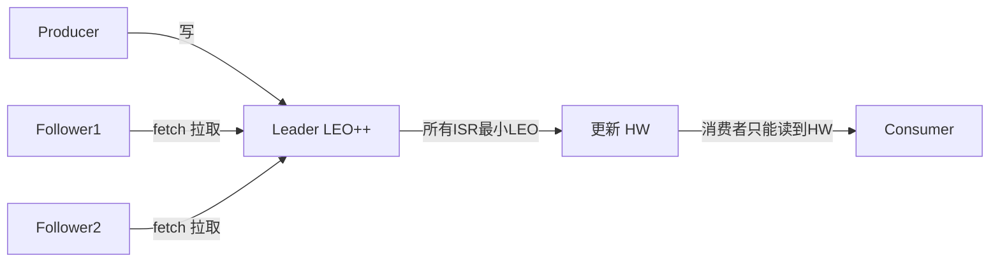

# 33 · Kafka 专项

> [11-消息队列](./11-消息队列MQ.md) 讲的是 MQ 通用选型与可靠性，本篇专攻 Kafka 的**深度拷打题**：架构与核心概念、为什么高吞吐、ISR/HW/LEO 副本机制、可靠性（acks/不丢/不重）、Exactly-Once、Rebalance、消费 offset、顺序与积压、调优。Kafka 是面试中被单独深挖最多的中间件。

---

## 一、架构与核心概念

### 1. 核心概念 🔥

| 概念 | 说明 |
| --- | --- |
| **Broker** | Kafka 服务节点，多个组成集群 |
| **Topic** | 逻辑消息分类 |
| **Partition** | Topic 的物理分区，**并行与扩展的基本单位**，分区内有序 |
| **Replica** | 分区副本，分 Leader 和 Follower，**只有 Leader 读写** |
| **Producer / Consumer** | 生产者 / 消费者 |
| **Consumer Group** | 消费组，组内每个分区只被一个消费者消费（并行消费 + 容错） |
| **Offset** | 消费位移，标记消费到哪了 |
| **Segment** | 分区物理上分段存储（`.log` + `.index`），便于清理 |

### 2. 架构图

```mermaid
flowchart LR
    P[Producer] -->|按 key 分区| T
    subgraph Topic
        T0[Partition0<br/>Leader@B1]
        T1[Partition1<br/>Leader@B2]
    end
    T0 -.副本同步.-> R0[Follower@B2]
    T1 -.副本同步.-> R1[Follower@B1]
    subgraph CG[Consumer Group]
        C0[Consumer0] --> T0
        C1[Consumer1] --> T1
    end
    ZK[ZooKeeper / KRaft<br/>元数据/选主] --- T
```

> Kafka 早期靠 **ZooKeeper** 存元数据和选主；新版本用 **KRaft（Raft 自管理）** 去掉 ZK 依赖，简化部署。

---

## 二、为什么 Kafka 高吞吐 🔥🔥（必考）

1. **顺序写磁盘**：消息追加写到分区日志末尾，顺序 IO 接近内存速度（远快于随机写，见 [32-操作系统](./32-操作系统.md)）。
2. **Page Cache**：写先进内核 Page Cache 异步刷盘，读多命中缓存，不在 JVM 堆管缓存（重启缓存仍在）。
3. **零拷贝（sendfile）**：消费时用 `FileChannel.transferTo` 直接把日志从 Page Cache 送到网卡，省去用户态拷贝（见 [32-操作系统](./32-操作系统.md) 零拷贝）。
4. **批量 + 压缩**：Producer 批量发送（`batch.size`/`linger.ms`），支持 lz4/zstd 压缩，减少网络与 IO。
5. **分区并行**：Topic 分多区，多 Producer/Consumer 并行读写，水平扩展。
6. **稀疏索引**：`.index` 稀疏存储 offset→物理位置，二分查找快速定位。

---

## 三、副本机制：ISR / HW / LEO 🔥🔥（高频深水区）

### 3. 几个关键概念

- **LEO（Log End Offset）**：每个副本下一条待写消息的 offset（日志末尾）。
- **HW（High Watermark，高水位）**：**所有 ISR 副本都已同步到的最小 LEO**，消费者**只能消费到 HW 之前**的消息（保证已被消费的消息一定有多副本，不会丢）。
- **ISR（In-Sync Replicas）**：与 Leader **保持同步**的副本集合（含 Leader）。Follower 落后超过 `replica.lag.time.max.ms` 会被踢出 ISR，追上再回来。
- **OSR**：落后的副本；AR = ISR + OSR。

### 4. 副本同步与 HW 更新



- Follower **主动 pull**（fetch）Leader 的数据（不是 push）。
- HW 取 ISR 中最小 LEO，消费者只能读到 HW，**保证可见的消息都已被足够副本持久化**。
- 这套机制就是 Kafka 在「一致性 vs 可用性」之间的可调平衡。

### 5. Leader 选举与 unclean ⭐

- Leader 挂了，从 **ISR** 中选新 Leader（数据最全）。
- `unclean.leader.election.enable=false`（默认）：ISR 全挂时**宁可不可用也不从 OSR 选**（防丢数据）；设 true 则可能丢数据换可用性。

---

## 四、可靠性：不丢、不重 🔥

### 6. 消息不丢的三段保证

- **Producer 端**：`acks=all`（Leader + 所有 ISR 确认）+ `retries` 重试 + `min.insync.replicas>=2`（ISR 不足时拒绝写，防只写到 Leader 就丢）。
- **Broker 端**：`replication.factor>=3`、`unclean.leader.election.enable=false`、刷盘策略。
- **Consumer 端**：**关闭自动提交，处理成功后手动提交 offset**（先消费后提交），避免拉到就提交导致处理失败丢消息。

### 7. acks 三个级别 🔥

| acks | 含义 | 取舍 |
| --- | --- | --- |
| `0` | 发了就不管 | 最快，可能丢 |
| `1` | Leader 写入即确认 | Leader 挂且未同步会丢 |
| `all`(-1) | Leader + 所有 ISR 确认 | 最可靠，最慢 |

### 8. 重复消费的根因与幂等 🔥

- 根因：消费者**处理完但 offset 未提交**就崩溃/Rebalance → 重启后重复消费（Kafka 默认 **at-least-once**）。
- 解决：**消费端幂等**（唯一键 + 去重表 / 状态机，见 [15-分布式](./15-分布式.md)）。

---

## 五、Exactly-Once（精确一次）⭐（加分深水区）

Kafka 0.11+ 支持 EOS，由三部分实现：

1. **幂等 Producer**（`enable.idempotence=true`）：每个 Producer 有 PID + 每分区递增序列号，Broker 去重，解决**单分区单会话**的重复写。
2. **事务（Transaction）**：跨分区原子写（`initTransactions`/`beginTransaction`/`commitTransaction`），配合 `transactional.id`。
3. **read-process-write 原子**：消费 + 处理 + 生产 + 提交 offset 在一个事务里（`sendOffsetsToTransaction`），消费端设 `isolation.level=read_committed` 只读已提交消息。

> 面试要点：Kafka 的 EOS 是**流处理场景（Kafka→Kafka）** 的精确一次，跨外部系统（如写 DB）仍需业务幂等兜底。

---

## 六、消费者与 Rebalance 🔥

### 9. Consumer Group 与分区分配

- 组内**一个分区只被一个消费者消费**，消费者数 > 分区数会有空闲消费者（所以**消费者并行度受分区数限制**）。
- 分配策略：Range、RoundRobin、**Sticky（粘性，尽量保留原分配减少变动）**、CooperativeSticky（增量再均衡）。

### 10. Rebalance（再均衡）🔥

消费组内分区重新分配的过程。**触发条件**：消费者加入/退出/崩溃、订阅 Topic 或分区数变化。

- **危害**：Rebalance 期间**整组停止消费（STW）**，影响可用性，频繁 Rebalance 是线上常见问题。
- **常见诱因与优化**：
  - 消费太慢导致心跳/poll 超时被踢 → 调 `max.poll.interval.ms`、`max.poll.records`（一次少拉点）、提升消费速度。
  - `session.timeout.ms` / `heartbeat.interval.ms` 配置不当。
  - 用 **CooperativeSticky** 协议做增量再均衡，减少 STW 范围。

### 11. offset 提交方式 ⭐

- **自动提交**（`enable.auto.commit=true`）：定时提交，简单但可能丢/重。
- **手动提交**：`commitSync`（同步可靠）/`commitAsync`（异步高吞吐），生产推荐**处理成功后手动同步提交**。
- offset 存在内部 Topic `__consumer_offsets`。

---

## 七、顺序、积压与存储

### 12. 如何保证顺序 🔥

- Kafka **只保证分区内有序**。需要有序的消息按 key 路由到**同一分区**（如同一订单 ID），消费端单线程处理该分区。
- 注意：Producer 设 `max.in.flight.requests.per.connection>1` + 重试可能乱序，要顺序需配合幂等或设为 1。

### 13. 消息积压怎么办 🔥

- 加分区 + 加消费者（受分区数限制）。
- 紧急：临时把积压转发到分区更多的新 Topic，再多消费者并行处理（见 [11-MQ](./11-消息队列MQ.md)）。
- 优化消费逻辑（批量、异步、下游扩容）。

### 14. 消息存储与清理 ⭐

- 分区物理上分多个 **Segment**（`.log` 数据 + `.index` 偏移索引 + `.timeindex` 时间索引）。
- 清理策略：`delete`（按时间 `retention.ms` / 大小删旧段）或 `compact`（日志压缩，同 key 只留最新，适合状态类数据）。

### 15. 为什么 Kafka 不像 RabbitMQ 那样删消息 ⭐

Kafka 是**基于 offset 的拉模型 + 顺序日志**，消息消费后不立即删，按保留策略统一清理。好处：支持多消费组重复消费、回溯消费（重置 offset），适合流处理/数据管道。

---

## 高频追问清单

- Kafka 为什么快？→ 顺序写 + Page Cache + 零拷贝 + 批量 + 分区并行（二）。
- HW 和 LEO 是什么，消费者能读到哪？→ 只能读到 HW（三）。
- 怎么保证不丢消息？→ acks=all + min.insync.replicas + 手动提交 offset（四）。
- Exactly-Once 怎么实现？→ 幂等 Producer + 事务 + read_committed（五）。
- Rebalance 危害与优化？→ STW，调 poll 参数 + CooperativeSticky（六）。
- Kafka 怎么保证顺序？→ 同 key 同分区，分区内有序（七）。
