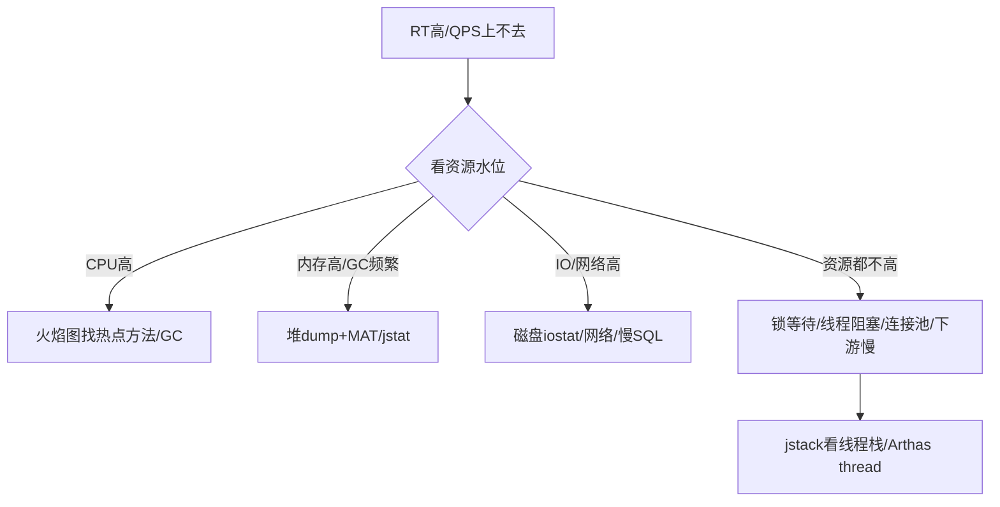

# 34 · 性能优化与压测方法论

> 这是**区分会调参的人和真正懂性能的架构师**的专题。面试官想听的不是「我加了缓存」，而是**一套可复现的方法论**：定指标 → 压测 → 定位瓶颈 → 优化 → 回归验证。本篇覆盖核心指标、压测方法、火焰图/JMH/Arthas 等工具、分层优化套路。

---

## 一、性能指标体系 🔥

### 1. 核心指标（先量化才能优化）

| 指标 | 含义 | 注意点 |
| --- | --- | --- |
| **QPS / TPS** | 每秒请求/事务数 | 吞吐 |
| **RT（响应时间）** | 单请求耗时 | **看分位（P99/P999）而非平均**，平均会掩盖长尾 |
| **并发数** | 同时处理的请求数 | |
| **错误率** | 失败占比 | SLA 重要维度 |
| **资源水位** | CPU/内存/IO/网络/连接数 | 定位瓶颈在哪一层 |

### 2. 三个关键公式 ⭐

- **little's law**：`并发数 = QPS × RT`。RT 降一半，同样并发下吞吐翻倍。
- **QPS = 线程数 / RT**（单机理论上限）。
- **木桶效应**：系统吞吐由最慢的一环（瓶颈）决定。

> 面试金句：**优化前先压测拿到基线（baseline），优化后回归对比，用数据说话**，不要拍脑袋。

---

## 二、压测方法论 🔥

### 3. 压测类型

| 类型 | 目的 |
| --- | --- |
| **基准测试** | 单接口性能基线 |
| **负载测试** | 逐步加压，找到性能拐点（容量规划） |
| **压力测试** | 超负荷，看系统极限与崩溃表现 |
| **稳定性测试** | 长时间运行，查内存泄漏/连接泄漏 |
| **全链路压测** | 生产环境模拟真实流量（电商大促必备） |

### 4. 压测四步法

1. **定目标**：明确 QPS/RT/错误率目标（如大促 5 万 QPS，P99<200ms）。
2. **造数据/流量**：贴近真实分布（热点 key、参数随机化），避免缓存全命中造成失真。
3. **逐步加压**：找到拐点——QPS 不再上升但 RT 飙升、错误率上升处即为容量上限。
4. **定位 + 优化 + 回归**：每次只改一个变量，对比验证。

### 5. 全链路压测的难点 ⭐（架构师题）

- **数据隔离**：压测流量打标（影子标记），写入**影子库/影子表**，不污染生产数据。
- **流量构造**：录制生产流量回放。
- **中间件改造**：MQ/缓存/RPC 透传影子标记。
- **下游隔离**：Mock 或限流第三方依赖，防止压测打垮外部系统。

### 6. 常用压测工具

| 工具 | 特点 |
| --- | --- |
| **JMeter** | 老牌，GUI，功能全 |
| **wrk / ab** | 轻量命令行，高并发 HTTP |
| **Gatling** | Scala DSL，报告漂亮 |
| **JMH** | **Java 微基准**（方法级，见下） |

---

## 三、瓶颈定位与工具 🔥🔥

### 7. 自上而下的定位顺序



> **资源都不高但慢** 是经典陷阱：往往是**锁竞争、线程池/连接池打满、同步等待下游**，要看线程栈而非加机器。

### 8. 火焰图（Flame Graph）⭐🔥

- **作用**：可视化 CPU 时间分布，**横轴是占用比例（越宽越热），纵轴是调用栈深度**，一眼看出热点方法。
- **采集**：`async-profiler`（推荐，开销低，可采 CPU/alloc/lock）、arthas `profiler` 命令、perf。
- 看图技巧：找**最宽的平顶**——那就是最该优化的热点。

### 9. JMH（Java Microbenchmark Harness）⭐

- 方法级微基准，**解决 JIT 预热、死代码消除、常量折叠** 等坑（手写 `System.nanoTime` 循环测得到的数都是错的）。
- 关键注解：`@Benchmark`、`@Warmup`（预热轮）、`@Measurement`、`@Fork`、`@BenchmarkMode`、用 `Blackhole` 消费结果防 DCE。

```java
@Benchmark
@BenchmarkMode(Mode.Throughput)
@Warmup(iterations = 3)
@Measurement(iterations = 5)
@Fork(1)
public void testHashMap(Blackhole bh) {
    bh.consume(map.get(key));   // Blackhole 防止 JIT 把结果优化掉
}
```

### 10. Arthas 线上诊断神器 🔥

| 命令 | 用途 |
| --- | --- |
| `dashboard` | 全局监控（线程/内存/GC） |
| `thread -n 3` | 最忙的 3 个线程（抓 CPU 飙高） |
| `thread -b` | 找死锁/阻塞线程 |
| `trace 类 方法` | 方法内部各调用耗时（定位慢在哪一行） |
| `watch` | 观察方法入参/返回/异常 |
| `profiler` | 生成火焰图 |
| `jad` / `redefine` | 反编译 / 热更新（线上验证） |

### 11. JDK 自带工具

- `jstat -gcutil`：看 GC 频率与各区占用。
- `jstack`：线程栈快照（找死锁/阻塞，CPU 高时配合 `top -Hp` 定位线程）。
- `jmap` + **MAT**：堆 dump 分析内存泄漏（看 Dominator Tree / 大对象）。
- `jcmd`：万能命令（GC、堆 dump、飞行记录 JFR）。

---

## 四、分层优化套路 🔥

### 12. 从上到下的优化手段

| 层次 | 优化手段 |
| --- | --- |
| **前端/网关** | CDN、静态化、Gzip、HTTP/2、连接复用 |
| **应用层** | 缓存（多级）、异步化、并行（CompletableFuture）、批量、池化 |
| **JVM** | 合适的 GC（G1/ZGC）、堆大小、减少对象分配、逃逸分析（见 [03-JVM](./03-JVM.md)） |
| **数据库** | 索引、慢 SQL 优化、连接池、读写分离、分库分表（见 [09-MySQL](./09-MySQL.md)） |
| **架构** | 限流降级、削峰填谷（MQ）、读写分离、水平扩展（见 [24-高并发高可用](./24-高并发高可用.md)） |

### 13. 性能优化的原则 ⭐

1. **先测量再优化**（避免过早优化，Knuth：过早优化是万恶之源）。
2. **抓主要矛盾**（二八定律：80% 耗时在 20% 代码）。
3. **权衡取舍**：空间换时间（缓存）、时间换空间、一致性换性能。
4. **优化有上限**：单机优化到头就要靠水平扩展/架构升级。

### 14. 常见性能反模式

- N+1 查询（循环里查库）→ 批量查 / `in`。
- 大事务、长事务占连接 → 拆小。
- 同步串行调用多个下游 → 并行（`CompletableFuture.allOf`）。
- 缓存粒度太大 / 缓存击穿 → 见 [10-Redis](./10-Redis.md)。
- 日志同步打印 / 大量字符串拼接 → 异步日志、占位符。
- 线程池配置不合理（IO 密集型设太小）→ 见 [04-并发编程](./04-并发编程.md)。

---

## 高频追问清单

- 接口慢怎么排查？→ 自上而下：资源水位→火焰图/线程栈/慢 SQL（三）。
- CPU 100% 怎么定位？→ `top -Hp` 找线程 + jstack/Arthas thread（三）。
- 为什么看 P99 不看平均 RT？→ 平均掩盖长尾（一）。
- 怎么做全链路压测？→ 流量打标 + 影子库 + 下游隔离（二）。
- 为什么不能用 for 循环 + nanoTime 测性能？→ JIT 预热/DCE，要用 JMH（三）。
- 并发数、QPS、RT 关系？→ 并发=QPS×RT（一）。
